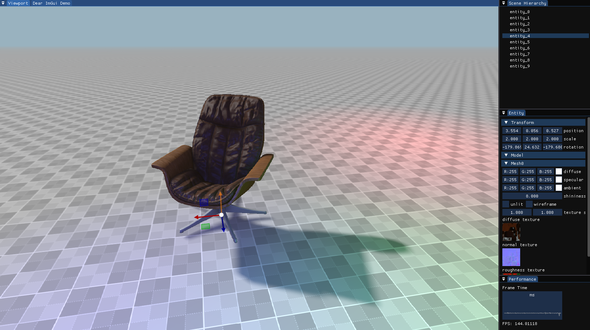
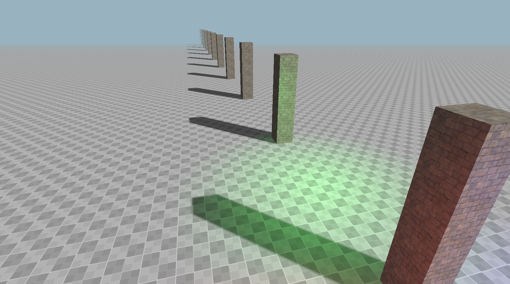
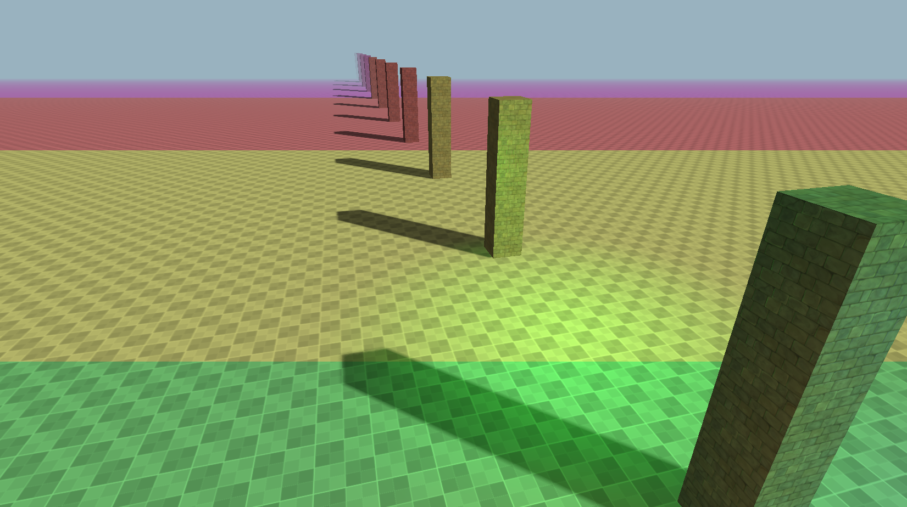
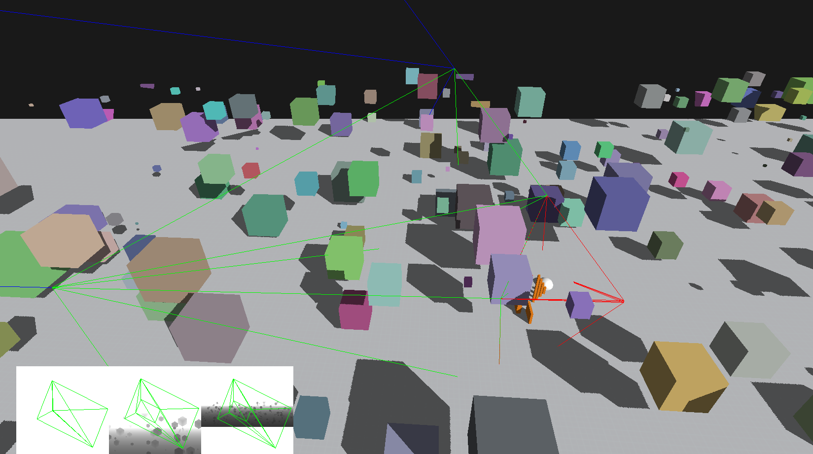

# Overview
This is a graphics engine created using OpenGL and Java, where I explore and implement different graphics programming techniques. Since I do this in my limited spare time the focus is mostly on implementing different techniques, for this reason the code structure is can be a bit bad in places.

The engine currently supports:
- Basic Phong lighting
- Directional and point lights
- Normal mapping
- Model loading using Assimp
- Interactive GUI with gizmos using ImGUI
- A simple ECS implementation
- Deferred rendering
- Cascaded Shadow Maps for directional lights

# Screenshots
Below is a screenshot of the application with a model of a chair loaded using Assimp. It contains some point lights and a directional light with shadows. In the GUI we can see a list of the entitites in the scene, and also information about the highlighted entitys (the chair) transform and model. We can also see a "gizmo" for translation centered on the currently selected chair.

## Cascaded Shadow Mapping
Below we can see an example of cascaded shadow mapping in the engine. As you can see the shadows extend all the way to the far plane, without losing detail in the shadows close to the camera. This is done by rendering multiple shadow maps, centered on different sections of the view frustum.

Below is a debug view of the shadow cascades, with the different colors showing the different levels of the shadow maps.

Below is a screenshot made during development of the shadow mapping. It shows a debug view of the divided view frustum used for creating the different shadow map levels.
